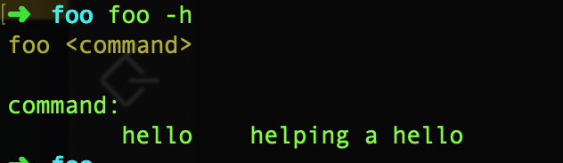
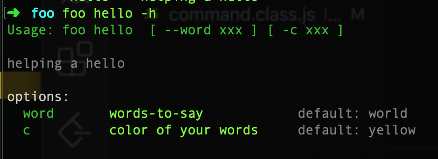
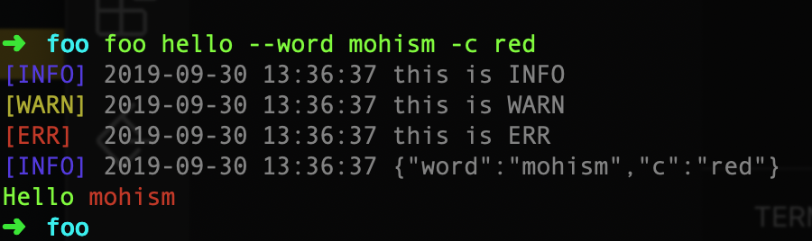

### 项目内开发

在你上一节创建的`foo`命令里，参考项目下 `src/commands/hello-world.action.ts`。

重点是要实现父类`ActionBase`的三个方法，下面会详细说

- `options(): Dict<ArgvOption>`
- `description(): string`
- `run(options: Dict<any>): Promise<any>`

然后在 `src/bin/index.ts` 里引入并注册。

```javascript
// load actions
import Hello from "../commands/hello-world.action";

instance.add("hello", Hello);
```

##### 然后我们针对 hello-world 例子的代码讲解一下

### options(): Dict<ArgvOption>

```javascript

options(): Dict<ArgvOption> {
	return {
	  word: { // option name
	    desc: 'words-to-say', // description
	    default: 'world', // default value
	  },
	  c: {
		desc: 'color',
		default: 'red',
	  }
	};
}

```

以上代码的意思是：

    1. 定义了这个命令的两个参数选项 `--word` `-c`
    2. 分别为两个选项设置描述信息和默认值

### description(): string

```javascript
description(): string {
  return `${'helping a hello'}`;
}
```

这里主要是返回一个字符串作为命令的介绍，
会在全局 help 信息以及 子命令 help 信息里显示。

### run(options: Dict<any>): Promise<any>

```javascript
async run(options: Dict<any>): Promise<any> {
	// 输出INFO
	this.info('this is INFO');
	// 输出WARN
	this.warn('this is WARN');
	// 输出ERR
	this.err('this is ERR');

	// 输出命令行参数
	this.info(argv);

	// 真正的逻辑
	const { word, c } = argv;
	console.log(`Hello ${word[c]}`);
}
```

这里主要是演示了一些内置方法和实现了打印 `hello-{world}` 的逻辑。

### 然后我们看看效果 (前提要执行 `npx tsc`)

> foo -h



> foo hello -h



> foo hello --word mohism -c red


