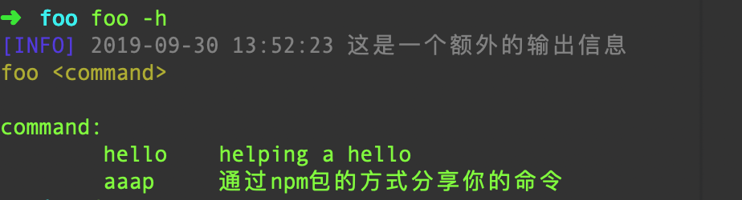
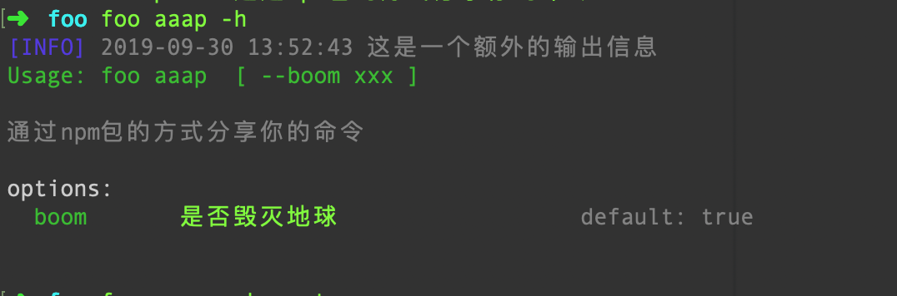

### 作为NPM包

熟悉了**项目内开发**子命令后，子命令的npm包开发方式并不神秘。

在一个新的项目下安装依赖 `@mohism/sloty`后，

把一个`ActionBase`的子类来发布为一个`nmp`的包。

具体方法方式和 **项目内开发** 是一样的，如果你需要一个例子作参考

可以看 

[ action-as-a-pkg ](https://github.com/mohism-framework/action-as-a-pkg). (一个插件命令hello-world)

[ self-upgrade ](https://github.com/mohism-framework/self-upgrade). (让你的工具可以自升级)

通过npm发布你的命令，你甚至可以让你实现的命令行功能，分享给其他人使用。


### 安装并使用别人发布的子命令

以上面的example为例: 

> // 从npm安装
> 
> npm i @mohism/action-as-a-pkg

然后按照先前的做法，在 `src/bin/index.ts`里引入并注册。

```javascript
// load actions
import Aaap from '@mohism/action-as-a-pkg';

instance.add('aaap', Aaap);
```

试一下:

> foo -h 



> foo aaap -h



> foo aaap --boom true

